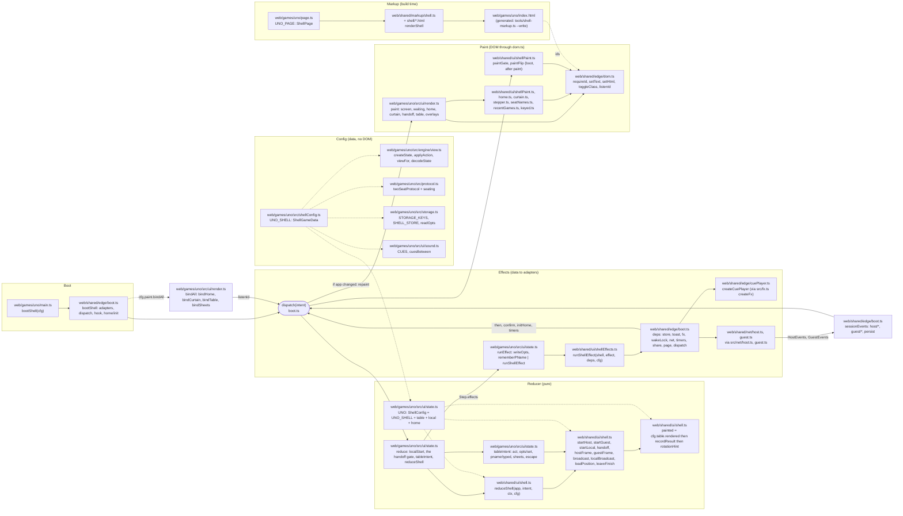

# The shell's call graph, traced through UNO

Measured on main `1a7ce8f0` (2026-10-02) by reading `web/games/uno/` whole against
`web/shared/{edge,ui,net,lib,markup}`, then every other shell game's `main.ts`, `shellConfig.ts`,
`ui/state.ts`, `ui/render.ts` and `ui/home.ts` for the places they differ. It is the owner's DRY
pass ("understand the call graph and improve it") made concrete: §1 draws the graph for one game and
the shell, §2 lists every function UNO hands the shell and how many games hand the same shape, §3
lists where each other game diverges, §4 ranks the hoists the graph shows that
[shell-hoist.md](shell-hoist.md) does not already hold. Nothing here changes code.

Two PRs landed while this was written (main `46bec718`) and change the picture where named: **#47**
(`hoist-cd-intents`, rows C+D of shell-hoist.md) deleted `SHELL_INTENTS`, `homeView`,
`fillNameInputs` and `fillP2NameInput` from every game's `ui/home.ts` and exports the last two from
`web/shared/ui/home.ts`; **#46** (`hive-no-hints`) edited `web/shared/ui/shell.ts`,
`web/shared/ui/shellPaint.ts`, `web/shared/ui/shellEffects.ts`, `web/shared/ui/toast.ts` (an
`errorToast`) and `web/shared/edge/settings.ts` (a hints row) for hive alone. Rows A, B, J and N had
no PR open yet.

## 1. The graph

One boot, one reducer loop, two side exits (effects and paint), one network loop back in. Every
box names its file; the dotted edges are what UNO supplies (§2), the solid ones the shell's own
calls. `dispatch` is the hub: every binder, timer, session event and effect-with-a-`then` returns
to it, and nothing but it repaints.



Reading it top to bottom for one tap on a card: `bindTable` (`render.ts`) hears `#hand`'s click
and dispatches `{ type: 'act', action: { type: 'play', id } }`; `reduce` finds it is not a shell
intent and hands it to `tableIntent`, which plays `fx('tap')` then `act`, which by role applies the
engine and calls the shell's `localBroadcast` or `broadcast` (or emits one `send`); the flow sets
`view`, runs `cfg.table.reset(table, 'view')`, emits `persist` and the `send`s, then `painted`
runs UNO's `rendered` (the cues since the last view, `screen: 'tableScreen'`), the shell's
`recordResult` and `rotationHint`; `dispatch` runs each effect through `runEffect` (the game's
two, then `runShellEffect` over `deps`) and, the App having changed, repaints through `paint`.

## 2. What UNO supplies to the shell

"Called from" is the shell function that reads the member. "Games" counts the shell games (uno,
flip7, hive, briscola, gin-rummy, backgammon, fidice; rps and ui-sandbox have no shell) that supply
the same member; "Identical" says whether their bodies agree once comments and the game name go.
`cfg.` is the `ShellConfig` the reducer builds (`UNO`); `boot.` the `BootConfig` `main.ts` passes.

### 2.1 The boot's config (`main.ts`, `BootConfig`)

| Name                                  | File                                                                        | Called from (web/shared/edge/boot.ts)           | Games | Identical                                                                                                                         |
| ------------------------------------- | --------------------------------------------------------------------------- | ----------------------------------------------- | ----- | --------------------------------------------------------------------------------------------------------------------------------- |
| `game: { hook, title, debug }`        | `web/games/uno/main.ts`                                                     | `bootShell` (the hook's window key, the share)  | 7     | Shape; three strings differ (fidice `debug: 1`)                                                                                   |
| `sound: { enabled, fontKey }`         | `web/games/uno/src/storage.ts` (`SHELL_STORE.sound`, `STORAGE_KEYS`)        | `homeSnapshot`, `createAudioCues`               | 7     | Yes: both come off `shellStore` (shell-hoist row O notes the derivation)                                                          |
| `reducer.initialApp`                  | `web/games/uno/src/ui/state.ts`                                             | `bootShell` (`let app`)                         | 7     | Yes: `{ shell: shellInitial(CFG), table: initialTable }`                                                                          |
| `reducer.reduce`                      | `web/games/uno/src/ui/state.ts`                                             | `dispatch`                                      | 7     | The `isShellIntent` partition in 7; the wrappers around it differ (§3)                                                            |
| `reducer.runEffect`                   | `web/games/uno/src/ui/state.ts`                                             | `dispatch`                                      | 7     | The `isShellEffect` partition in 7; the game cases differ                                                                         |
| `reducer.readHome`                    | `web/games/uno/src/ui/state.ts`                                             | `homeSnapshot`                                  | 7     | Yes: `shellReadHome(store, CFG)`                                                                                                  |
| `reducer.hostContextOf`               | `web/games/uno/src/ui/state.ts`                                             | `deps.net.startHost` (`read`)                   | 7     | 4 add `seats: app.shell.seats` (uno, flip7, briscola, fidice: identical); 3 return the shell's                                    |
| `reducer.guestContextOf`              | `web/games/uno/src/ui/state.ts`                                             | `deps.net.startGuest` (`read`)                  | 7     | Yes: `shellGuestContextOf(app.shell)`                                                                                             |
| `paint.paint`                         | `web/games/uno/src/ui/render.ts`                                            | `repaint`                                       | 7     | The prologue (screen, waiting, home, curtain, handoff, table, overlays) in that order in 7; gin's takes a `handView`              |
| `paint.bindAll`                       | `web/games/uno/src/ui/render.ts`                                            | `bootShell`                                     | 7     | Shape (home, curtain, table, sheets); hive binds no curtain, gin and backgammon their own `bindSheets`                            |
| `paint.paintSound`                    | `web/games/uno/src/ui/render.ts`                                            | `bootShell`, `onToggle`                         | 7     | Yes (row N)                                                                                                                       |
| `paint.fillName`, `fillP2Name`        | `web/games/uno/src/ui/home.ts`                                              | `deps.page`                                     | 7     | Yes (row D); since #47 a re-export of the shell's                                                                                 |
| `paint.setCode`                       | `web/shared/ui/home.ts` (re-exported)                                       | `deps.page`                                     | 7     | Yes                                                                                                                               |
| `paint.toastMarks`                    | absent                                                                      | `createToaster`                                 | 1     | backgammon alone                                                                                                                  |
| `fx: createFx`                        | `web/games/uno/src/fx.ts`                                                   | `bootShell`                                     | 7 (+rps) | Yes (row A)                                                                                                                    |
| `net.Host`, `net.Guest`               | `web/games/uno/src/net/host.ts`, `guest.ts`                                 | `deps.net.startHost`, `startGuest`              | 7     | One shape, the `welcome` adapter the only game line (row K)                                                                       |
| `net.isGuestFrame`                    | `web/games/uno/src/protocol.ts` (re-export of `web/shared/lib/protocol.ts`) | `deps.net.send`                                 | 7     | Yes                                                                                                                               |
| `net.seats: true`                     | `web/games/uno/main.ts`                                                     | `sessionEvents`                                 | 4     | uno, flip7, briscola, fidice; derivable from `cfg.seats`                                                                          |
| `net.isEphemeral`                     | absent                                                                      | `deps.net.send`                                 | 1     | briscola alone                                                                                                                    |
| `legal: legalActions`                 | `web/games/uno/src/engine/view.ts`                                          | `hook.legal`                                    | 7     | Shape                                                                                                                             |
| `deps: {}`                            | `web/games/uno/main.ts`                                                     | spread into `deps`                              | 7     | `{}` in 6; gin `{ scorer, copy }`                                                                                                 |
| `shell: CFG`                          | absent                                                                      | `paintGate`, `paintFlip`, the media watchers    | 1     | backgammon alone (`orientation: 'landscape'`)                                                                                     |
| `hooks.home`                          | absent                                                                      | `homeSnapshot`                                  | 3     | briscola (card pack, lang), gin (card back), fidice (legacy name, legacy invite)                                                  |
| `hooks.render`                        | `web/games/uno/main.ts`                                                     | `bootShell`, before the binders                 | 7     | `renderRules` + `renderAbout` in 6 (row N/O); hive and briscola prepend sprites, gin the sandbox and scorer, fidice dice styles   |
| `hooks.bind`                          | absent                                                                      | after the binders                               | 1     | gin alone (`scorer.bind`)                                                                                                         |
| `hooks.hook` (`act`, `view`, `setup`) | `web/games/uno/main.ts`                                                     | the `window.__uno` hook                         | 7     | Identical in 6 (row O); gin's set differs. Extras: uno `playable`, flip7 `game`, hive `legal` (a copy of the boot's own member), briscola `events`/`cardPack`/`lang`, gin eight |

### 2.2 The config's data half (`shellConfig.ts`, `ShellGameData`)

| Name                                                  | File                                                                 | Called from (web/shared/ui/shell.ts)                               | Games | Identical                                                                                                            |
| ----------------------------------------------------- | -------------------------------------------------------------------- | ------------------------------------------------------------------ | ----- | -------------------------------------------------------------------------------------------------------------------- |
| `id`                                                  | `web/games/uno/src/shellConfig.ts`                                   | `reduceShell` (`validateCode`, `sanitiseCode`), `startHost`        | 7     | Shape                                                                                                                |
| `names.default`, `localNames`                         | `web/games/uno/src/shellConfig.ts`                                   | `initialShell`, `reduceShell` `host/click`, `localNamesOf`         | 7     | Shape (gin has no `localNames`)                                                                                      |
| `tabs`                                                | `web/games/uno/src/storage.ts` (`HOME_TABS`, `DEFAULT_HOME_TAB`)     | `initialShell`, `setHomeTab`, `readHome`                           | 7     | Yes: `['play','rules','about']` (gin adds `score`) (row M)                                                           |
| `modes.default`, `modes.parse`                        | `web/games/uno/src/shellConfig.ts`                                   | `initialShell`, `readHome`, `reduceShell` `mode/set`               | 7     | `parse` identical in 6 (`raw === 'local' ? 'local' : 'online'`, shown = stored); gin's sandbox differs             |
| `copy` (12 members)                                   | `web/games/uno/src/shellConfig.ts`                                   | `startHost`, `startGuest`, `guestFrame`, `guestGone`, `hostFrame`, `reduceShell` `leave/request`, `host/deal` | 7 | The 5 two-seat members in 7; the 7 N-seat forms identical in uno, flip7, briscola, fidice two strings off (row B) |
| `seats: { min, max, fixed }`                          | `web/games/uno/src/shellConfig.ts`                                   | `isNSeat`, `capacityOf`, `minSeated`, `roomSeatingOf`, `startHost` | 4     | uno 2..12, flip7 2..12, briscola 2..4 (all `fixed`); fidice 1..6 not fixed                                           |
| `opts.initial`, `parse`, `ofGame`, `pick`, `capacity` | `web/games/uno/src/shellConfig.ts`, `storage.ts`                     | `initialShell`, `reduceShell` `host/click`/`local/click`, `handoff`, `guestFrame`, `resumeFor`, `capacityOf` | 7 | The four N-seat games are one shape over `seatCount` (row B `parseOpts`); hive's three return `DEFAULT_OPTS` |
| `engine.create`, `apply`, `viewFor`, `decodeState`    | `web/games/uno/src/engine/view.ts`                                   | `reduceShell` `local/click`/`host/deal`, `hostDispatch`, `broadcast`, `localBroadcast`, `loadPosition` | 7 | Each engine's own                                                                                              |
| `engine.over`, `finished`                             | `web/games/uno/src/shellConfig.ts`                                   | `gateOpen`, `recordResult`, `guestGone`, `resumeFor`               | 7     | One predicate each, 7 spellings                                                                                      |
| `engine.gameOver`                                     | absent                                                               | `gateOpen`                                                         | 1     | backgammon alone                                                                                                     |
| `engine.names`                                        | `web/games/uno/src/shellConfig.ts`                                   | `handoff`                                                          | 7     | The two-name tuple in 7 (row E `allNames`)                                                                           |
| `engine.renameGuest`                                  | `web/games/uno/src/shellConfig.ts`                                   | `hostFrame` (a rejoin's name)                                      | 7     | One spread each                                                                                                      |
| `result.keyOf`, `playersOf`, `scoreOf`, `winnerOf`    | `web/games/uno/src/shellConfig.ts`                                   | `recordResult`, `localSeated`, `guestFrame`                        | 7     | `keyOf` is `String(view.startedAt)` in 6 (fidice `code@at`); the rest each view's own                                |
| `result.seatName`                                     | absent                                                               | `guestFrame`                                                       | 1     | fidice alone (chairs, not seats)                                                                                     |
| `frames: { lobby, state, toast, action, join }`       | `web/games/uno/src/protocol.ts`                                      | `lobbySends`, `broadcast`, `hostDispatch`, `reduceShell` `name/rename`, the game's `act` | 7 | Yes: one destructure of the protocol (row L)                                                              |
| `cues.initial`                                        | `web/games/uno/src/ui/sound.ts`                                      | `initialShell`, `leaveFinish`                                      | 7     | Yes: `{ key: null }` (row N; gin adds `turnKey`)                                                                     |
| `home.read`                                           | `web/games/uno/src/shellConfig.ts`                                   | `readHome`                                                         | 7     | Each game's keys: uno `opts` + `extraNames` (= flip7, = fidice modulo its terms; briscola adds pack, lang, speed)    |
| `prefs: SHELL_STORE`                                  | `web/games/uno/src/storage.ts`                                       | `readHome`, `runShellEffect` (every write)                         | 7     | Yes: `shellStore(STORAGE_KEYS, …)` (row M)                                                                           |

### 2.3 The config's table half (`ui/state.ts`, the rest of `ShellConfig`)

| Name                                | File                                | Called from (web/shared/ui/shell.ts)                                                           | Games | Identical                                                                                                                                         |
| ----------------------------------- | ----------------------------------- | ---------------------------------------------------------------------------------------------- | ----- | ------------------------------------------------------------------------------------------------------------------------------------------------- |
| `table.initial`                     | `web/games/uno/src/ui/state.ts`     | `initialApp` (the game's), `reset`                                                             | 7     | Each table's own                                                                                                                                  |
| `table.reset(table, at)`            | `web/games/uno/src/ui/state.ts`     | `broadcast`, `localBroadcast`, `localSeated`, `hostDispatch`, `handoff`, `leaveFinish`, `guestFrame`, `loadPosition`, `reduceShell` `host/deal`/`guest/lost` | 7 | uno = flip7 (plus `pause: null` at `deal`) = hive (plus the five pick fields): "clear all but the remembered prefs at start/handoff/leave/lost" (row P) |
| `table.rendered(app, prev, ctx)`    | `web/games/uno/src/ui/state.ts`     | `painted` (after every view, frame, `render`, `guest/lost`)                                    | 7     | uno = hive modulo `turnOf`; flip7 adds `pauseFor`; briscola, gin, backgammon, fidice their own (row P)                                            |
| `table.refuse(app, message)`        | `web/games/uno/src/ui/state.ts`     | `hostDispatch`, `guestFrame` (`toast` frame), the game's `act`                                 | 7     | uno = flip7: `step(app, toast(message))`; the other five also drop a selection or a drag                                                          |
| `table.ephemeral`                   | absent                              | `hostFrame`, `guestFrame`                                                                      | 1     | briscola alone                                                                                                                                    |
| `local.viewer(app, game)`           | `web/games/uno/src/ui/state.ts`     | `localBroadcast`, `hostDispatch`                                                               | 7     | Each game's rule; `effects: []` in 6 (backgammon's hit toasts)                                                                                    |
| `local.revealer(game)`              | `web/games/uno/src/ui/state.ts`     | `reduceShell` `curtain/reveal`, `startLocal`, `loadPosition`                                   | 7     | `{ seat: <the actor>, effects: [] }` in 6; backgammon adds effects                                                                                |
| `local.holder`                      | absent                              | `flipped`                                                                                      | 1     | backgammon alone                                                                                                                                  |
| `home.apply(app, home)`             | `web/games/uno/src/ui/state.ts`     | `initHome`, `setHomeTab`                                                                       | 7     | Mirrors `home.read`: uno = flip7 = fidice (opts into the shell, extra names onto the table)                                                       |
| `home.resume(home)`                 | `web/games/uno/src/ui/state.ts`     | `initHome`, `guestFrame`                                                                       | 7     | `(home) => resumeFor(home.save)` in 6; gin's scorer first                                                                                         |
| `home.resumeExtra`                  | `web/games/uno/src/ui/state.ts`     | `initHome`, `resume`                                                                           | 7     | `pure` in 6; gin's `scorer` effect                                                                                                                |

### 2.4 Supplied by shape, not by config

Not members of a config, but functions every game writes because the shell expects the result.

| Name                                                                  | File                                          | Called from                                                           | Games | Identical                                                                                                                                  |
| --------------------------------------------------------------------- | --------------------------------------------- | --------------------------------------------------------------------- | ----- | ------------------------------------------------------------------------------------------------------------------------------------------ |
| `SCREENS` (the five screen ids)                                       | `web/games/uno/src/ui/state.ts`               | `paintScreen` in the game's `paint`                                   | 7     | Yes: the five literals `ScreenId<G>` already spells                                                                                        |
| `fx(cue)` → `{ type: 'fx', cue }`                                     | `web/games/uno/src/ui/state.ts`               | `rendered`, `tableIntent`                                             | 5     | Yes (uno, hive, briscola, fidice; flip7 inlines it)                                                                                        |
| `cueKey(view)`                                                        | `web/games/uno/src/ui/state.ts`               | `rendered`                                                            | 4     | Shape; the view fields differ (uno `startedAt:drawCount:top:turn:phase`)                                                                   |
| `resumeFor(save)`                                                     | `web/games/uno/src/ui/state.ts`               | `home.resume`, `home.ts` tests                                        | 7     | Yes: `shellResumeFor(save, CFG)` (gin adds the scorer)                                                                                     |
| `localStart` (the `local/click` intercept)                            | `web/games/uno/src/ui/state.ts`               | `reduce`, before `reduceShell`                                        | 6     | uno = flip7 (N seats off `Raw.names` + `extraNames` through `localSeats`); briscola, fidice the same idea; hive's is the shell's own case; backgammon passes `manualTurnEnd: true` the config's `engine.create` does not |
| The handoff's two-seat gate (`handoff/click` ignored past two)        | `web/games/uno/src/ui/state.ts` `seatCountOf` | `reduce`, before `reduceShell`; `paint` (the `#handoffBtn` label)     | 4     | uno = briscola (`seatCountOf(app) !== 2`), flip7 by `game.seats.length`, fidice `handoffable` (also the resume offer)                       |
| `SHEETS` (`rulesOverlay`, `historyOverlay` and their close buttons)   | `web/games/uno/src/ui/render.ts`              | `bindSheets(doc, SHEETS, dispatch, { escapeFallback })`               | 7     | uno = flip7 = hive = fidice (fidice adds the ladder); briscola adds the deck; gin and backgammon spell their own `bindSheets` (row F)      |
| The five shell button rows (`leaveBtn`, `soundBtn`, `handoffBtn`, `rulesBtnGame`, `historyBtn`) | `web/games/uno/src/ui/render.ts` `bindTable` | `bindButtons`                                       | 7     | Identical rows in 5; backgammon dispatches `rules/toggle`/`history/toggle`, gin `history/open` with `who: 'game'`                         |
| `paintConnDot(doc, 'oppDot', connDotView(app.shell))`                 | `web/games/uno/src/ui/render.ts`              | the game's `paintTable`                                               | 7     | Yes; the id is `connDot` in gin and fidice                                                                                                 |
| `paintOverlays` (rules, history, recent games)                        | `web/games/uno/src/ui/render.ts`              | the game's `paint`                                                    | 7     | uno = flip7 = hive = fidice (plus the ladder); briscola paints its event history too; gin and backgammon theirs (row F)                   |
| `paintCurtain` (title "Pass the phone to X", sub, last, button)       | `web/games/uno/src/ui/render.ts`              | the game's `paint`                                                    | 6     | Same title; the sub and the button are copy (row T, left alone); hive paints none                                                          |
| `paintHandoff` (`handoffLabel(game)` while the game seats two)        | `web/games/uno/src/ui/render.ts` (inline)     | the game's `paint`                                                    | 7     | uno inline = flip7's wrapper = briscola; hive, gin, backgammon test nothing (two seats always); fidice `handoffable` (row E for the label) |
| The session codec's `welcome` adapter                                 | `web/games/uno/src/net/host.ts`               | `HostSession` on a channel open                                       | 7     | One line each (row K)                                                                                                                      |
| `UNO_PAGE: ShellPage = { copy, notes, look, blocks }`                 | `web/games/uno/page.ts`                       | `tools/shell-markup.ts` → `renderShell` → `index.html`                | 7     | `look` identical in 6 (row J); `blocks.table` and `sheetsBefore` the game's                                                                |

## 3. Where the other games diverge from UNO

One line per divergence, the file that holds it. UNO is the baseline because it is the youngest
clone and carries the least: an N-seat game with no timers, no ephemeral lane, no extra deps and no
orientation.

**flip7**

- A `pause` in `Table` with `continue/click`, `pauseFor` inside `rendered` and `paintPause` (`web/games/flip7/src/ui/state.ts`, `render.ts`): the hold-until-Continue rule (shell-hoist row H).
- `myTurnNow` through `isMyTurn(view)` rather than `view.turn === view.seat` (`web/games/flip7/src/ui/state.ts`).
- The hook adds `game()` (the engine state on this device) where uno adds `playable()` (`web/games/flip7/main.ts`).
- A second handoff button under the curtain, `curtainHandoffBtn`, with `toggleHandoffUnderCurtain` (`web/games/flip7/src/ui/render.ts`).
- `bindAll` first writes the animation clock (`writeClock(doc, durationsFor(reducedMotion()))`) (`web/games/flip7/src/ui/render.ts`).
- Called `shellIntents<Flip7>()` before #47 brought uno, hive and briscola to it (`web/games/flip7/src/ui/home.ts`).

**hive**

- Two seats: no `seats`, no N-seat copy, `opts` is three `() => DEFAULT_OPTS`, `hostContextOf` is the shell's (`web/games/hive/src/shellConfig.ts`, `ui/state.ts`).
- No curtain: `viewer` returns `curtain: null`, `bindAll` binds none, `paint` paints none (`web/games/hive/src/ui/state.ts`, `render.ts`).
- `localStart` is the shell's `local/click` case spelled again (two seats, `localSeats`, `startLocal`) (`web/games/hive/src/ui/state.ts`).
- The hook's `legal()` duplicates the member `bootShell` already puts on every hook from `cfg.legal` (`web/games/hive/main.ts`, `web/shared/edge/boot.ts`).
- A `motion` preference (`home.read`, `home.apply`, `motion/toggle`, the one `motion/write` effect) and `paintMotion` (`web/games/hive/src/ui/state.ts`, `render.ts`, `storage.ts`).
- Drag state (`picked`, `drag`, `aim`, `peek`, `peekShut`, `hop`) cleared inside `rendered` and at every `reset` site; `bindDrag` over `dragger.ts` (`web/games/hive/src/ui/state.ts`, `ui/dragger.ts`).
- `resultSeen` + `result/continue` (the dismiss flag, row F) (`web/games/hive/src/ui/state.ts`).
- `hooks.render` prepends `BUG_SPRITE_SVG` (`web/games/hive/main.ts`).
- Since #46: a hints switch (`HIVE_HINTS` in `web/shared/edge/settings.ts`), and a refused tile's rule in a red `errorToast` (`web/shared/ui/toast.ts`).

**briscola**

- An ephemeral lane: `Ephemeral: IntentFrame`, `table.ephemeral`, `net.isEphemeral`, the `mirror`/`budget`/`relayFrom` machinery (`web/games/briscola/src/ui/state.ts`, `protocol.ts`, `main.ts`).
- Timers `settle | tip | intent` with `startTimer` effects; `reduce` is `forIntent` → `reduceInner` → `withIntent` (`web/games/briscola/src/ui/state.ts`).
- `rendered` keeps a `settle` beat, `lastPainted` and the mirror; `viewer` holds the phone while a trick settles (`web/games/briscola/src/ui/state.ts`).
- Card pack, language and speed preferences with `hooks.home` guards (`dropBadCardPack`, `dropBadLang`) and `cardPack`/`lang` hook members (`web/games/briscola/main.ts`, `src/storage.ts`).
- A stories boot on `?story=` before `bootShell` (`web/games/briscola/main.ts`, `src/stories/boot.ts`).
- `refuse` drops the selection and plays `bad.refused`; `escape` closes the card view, a drag, a lift, the deck, then history, then rules (`web/games/briscola/src/ui/state.ts`).
- `paintOverlays` paints the event history (`paintHistory`) above the recent games; a deck sheet and a card view (`web/games/briscola/src/ui/render.ts`).
- `pname/typed` trims the name (`intent.value.trim()`) where uno stores it as typed (`web/games/briscola/src/ui/state.ts`).

**gin-rummy**

- `reduce` runs `withP1Name` after the shell's step (the typed name locks or unlocks the sandbox); no `local/click` intercept (`web/games/gin-rummy/src/ui/state.ts`).
- `Resume` adds `{ kind: 'scorer' }`; `home.resume(home.save, home.scorer)`; `resumeExtra` emits the `scorer` effect; `deps` carries `scorer` and `copy` (`web/games/gin-rummy/src/ui/state.ts`, `main.ts`).
- `hooks.home` drops a bad card back, `migrateCardBack` runs before the boot, `hooks.bind` binds the Score Counter (`web/games/gin-rummy/main.ts`).
- `paint(doc, app, handView)`: the hand view is injected (`slotHandView`) (`web/games/gin-rummy/src/ui/render.ts`, `main.ts`).
- `rendered` uses `nextCue` over a `CueMemory` with `turnKey`, routes `gameOver` to `endgameScreen`, and emits `scrollTop` every paint (`web/games/gin-rummy/src/ui/state.ts`).
- `history: 'game' | 'scorer' | null` and a `sandboxHelpOverlay`; `paintRecentGames` only for the game's history (`web/games/gin-rummy/src/ui/state.ts`, `render.ts`).
- `modes.parse(raw, shell)` reads the shell for the sandbox unlock; `tabs` adds `score` (`web/games/gin-rummy/src/shellConfig.ts`).
- `bindLongPress` on the hand (`cardPress` timer) (`web/games/gin-rummy/src/ui/render.ts`).
- The hook adds `setHomeTab`, `setPlayMode`, `layoffs`, `sandbox`, `sandboxMap`, `cardPack`, `cardPackName`, `cardBack`; no `view`/`setup` (`web/games/gin-rummy/main.ts`).

**backgammon**

- `orientation: 'landscape'` and `shell: BACKGAMMON` in the boot: the media watchers, the turn gate and the flip (`web/games/backgammon/src/shellConfig.ts`, `main.ts`).
- `local.holder`, `engine.gameOver`, `paint.toastMarks` (`web/games/backgammon/src/ui/state.ts`, `shellConfig.ts`, `main.ts`).
- `reduce` intercepts `guest/lost` when the match is over (`hostLeft`) (`web/games/backgammon/src/ui/state.ts`).
- Timers `shake | noMove | tumble`; `rendered` over `freshKey`, with hit toasts, two timers and `scrollTop`; `endgameScreen` at `matchOver` (`web/games/backgammon/src/ui/state.ts`).
- Two option writes (`variant/set` → `writeVariant`, `matchLength/set` → `writeMatchLength`) in place of one `opts/set` → `writeOpts` (`web/games/backgammon/src/ui/state.ts`).
- `localStart` passes `manualTurnEnd: true`, which the config's `engine.create` does not: pass-and-play and the host deal differently (`web/games/backgammon/src/ui/state.ts`, `shellConfig.ts`).
- A `curtainMode` preference on the table and a menu sheet (`menuOverlay`, `menu/toggle`); `rules/toggle` and `history/toggle` instead of open/close (`web/games/backgammon/src/ui/state.ts`, `render.ts`).
- `paintRules(doc, app)` in the paint; `watchSafeArea(document, window)` after the boot (`web/games/backgammon/src/ui/render.ts`, `main.ts`).

**fidice**

- Two boots: the legacy `Controller` or `bootShellPath`, chosen by `shellPathOn(store, ?shell=)` (`web/games/fidice/main.ts`, `src/flag.ts`).
- `seats: { min: 1, max: 6 }`, not fixed; `result.seatName: () => null` (chairs, not seats); `keyOf` is `code@log[0].at` (`web/games/fidice/src/shellConfig.ts`).
- `reduce` is `reduceInner` then `scheduled` (the bots' steps and the auto-next, `Timer: GameTimer`) (`web/games/fidice/src/ui/state.ts`).
- `forgetPName` beside `rememberPName`; `handoffable(app)` reads the game or the resume offer (`web/games/fidice/src/ui/state.ts`).
- `paint` calls `paintTable(doc, app, Date.now())`: a clock read inside the paint; `paintNames`, `bindWaiting`, a `DISPATCHES` map (`web/games/fidice/src/ui/render.ts`).
- `hooks.home` adopts the legacy name and rewrites a legacy `#join=` invite; `hooks.render` injects the dice styles and binds the help fold (`web/games/fidice/main.ts`).
- `viewer` shows nothing new while a bot holds the cup (`web/games/fidice/src/ui/state.ts`).

## 4. The next hoists the graph shows

Ranked as shell-hoist.md ranks: copies × likeness, least divergence first, an API that exists before
one that needs a design. None of these is a row there; where one touches a row (B, E, F, M, O, P)
it says so. Minutes are one lane's, gate included. Every one keeps `index.html`, the goldens and
the class contract byte for byte: these are reducer, config and boot shapes, not markup.

| Rank | What                                                                                        | Copies                                                                                                                                                             | Min |
| ---- | ------------------------------------------------------------------------------------------- | ------------------------------------------------------------------------------------------------------------------------------------------------------------------ | --- |
| 1    | Two deletes with no replacement: hive's hook `legal`, hive's `localStart`                   | `web/games/hive/main.ts`, `web/games/hive/src/ui/state.ts`                                                                                                        | 10  |
| 2    | `seats` in the shell's host context                                                         | `hostContextOf` in `web/games/{uno,flip7,briscola,fidice}/src/ui/state.ts` (identical)                                                                            | 20  |
| 3    | Defaults for the config's identical members                                                 | `refuse` (2), `revealer`/`viewer` `effects: []` (6), `home.resume`/`resumeExtra` (6), `modes.parse` (6), `opts` for a game without terms (hive)                     | 30  |
| 4    | `SHELL_SCREENS`, `shellButtons<G>()`, `paintShellChrome`                                    | `SCREENS` in 7 `ui/state.ts`; five button rows in 7 `ui/render.ts`; the paint prologue and `paintConnDot` in 7                                                    | 40  |
| 5    | The handoff's two-seat gate                                                                 | `seatCountOf` + the `reduce` line + the label test in `web/games/{uno,flip7,briscola,fidice}/src/ui/{state,render}.ts`                                           | 30  |
| 6    | The room's terms remembered by the shell (`opts/set`, `writeOpts`, `prefs.opts`)            | `web/games/{uno,flip7,briscola,fidice}/src/ui/state.ts` (identical), backgammon's two writes                                                                      | 45  |
| 7    | The extra seat names as shell state, and an N-seat `local/click`                            | `extraNames` + `pname/typed` + `rememberPName` + `home.read`/`apply` + `localStart` in `web/games/{uno,flip7,briscola,fidice}/src/ui/state.ts`                     | 60  |
| 8    | `shellReducer(cfg, table)`: the boot's `reducer` block built from the config                | `initialApp`, `reduce`, `runEffect`, `readHome`, `resumeFor`, `hostContextOf`, `guestContextOf` in 7 `ui/state.ts` (~40 lines each)                              | 60  |

### 4.1 Two deletes (rank 1)

`bootShell` puts `legal: () => cfg.legal(app.shell.view)` on every hook (`web/shared/edge/boot.ts`);
hive's `hooks.hook` spreads an identical `legal` after it (`web/games/hive/main.ts`). Hive's
`localStart` (`web/games/hive/src/ui/state.ts`) is `reduceShell`'s own `local/click` case over
`localPlayers` and `startLocal` with the same names and the same `opts`. Per-game diff: minus 5 and
minus 6 lines in hive; `hive.spec.ts` reads `window.__hive.legal()` and sees the boot's. No other
game changes.

### 4.2 `seats` in the host context (rank 2)

```ts
// web/shared/ui/shell.ts
export type HostContextOf<G extends ShellTypes> = Readonly<{
  attempt: number; role: Role | null; code: string | null; myName: string;
  hasGame: boolean; handoff: boolean; oppName: string | null; oppConnected: boolean;
  /** The guest seats as the shell holds them; a two-seat codec reads none of it. */
  seats: ReadonlyArray<SeatState>;
}> & G['Opts'];
export const hostContextOf = <G extends ShellTypes>(s: ShellState<G>): HostContextOf<G>; // adds `seats: s.seats`
```

The `HC` type parameter leaves `bootShell`, `BootConfig`, `HostDepsOf` and `reducer.hostContextOf`
(`web/shared/edge/boot.ts`). Per-game diff: uno, flip7, briscola and fidice delete their
`HostContext` type and the four-line `hostContextOf`, and `main.ts` drops the fourth type argument
(`bootShell<Uno, App>`); their `src/net/host.ts` codecs read `ctx.seats` as they do. Hive, gin and
backgammon change nothing. `sessions.test.ts` in briscola and fidice build the context by hand: they
gain one field.

### 4.3 Config defaults (rank 3)

```ts
// web/shared/ui/shell.ts: these members of ShellConfig become optional, with the shell's body as the default
table.refuse?: (app, message) => Step<G>;            // default: step(app, toast(message))              (uno, flip7)
local.viewer: (app, game) => { seat; curtain; effects?: ReadonlyArray<Effect<G>> };  // effects default []  (6 of 7)
local.revealer: (game) => { seat; effects?: ReadonlyArray<Effect<G>> };              // effects default []  (6 of 7)
home.resume?: (home) => Resume<G> | null;           // default: resumeFor(home.save, cfg)              (6 of 7)
home.resumeExtra?: (app, offer, ctx) => Step<G>;    // default: pure                                    (6 of 7)
modes.parse?: (raw, shell) => …;                    // default: raw === 'local' ? local/local : online/online (6 of 7)
opts?: …;                                           // absent: Opts is {} and every reader returns it   (hive)
```

Per-game diff: `UNO` (`web/games/uno/src/ui/state.ts`) becomes
`{ ...UNO_SHELL, table: { initial, reset, rendered }, local: { viewer, revealer }, home: { apply } }`
and loses `refuse`, both `effects: []`, `resume`, `resumeExtra` and `modes.parse` (about 15
lines); flip7 the same; hive also its three-line `opts`; briscola, backgammon and fidice lose
`resume`/`resumeExtra`/`modes.parse` and the two `effects: []`. Gin keeps its own `refuse`,
`resume`, `resumeExtra` and `modes.parse`. `shell.test.ts` gains the defaults' cases over the fake
game; the games' `state.test.ts` pin outcomes, not the config literal.

### 4.4 `SHELL_SCREENS`, `shellButtons`, `paintShellChrome` (rank 4)

```ts
// web/shared/ui/shell.ts
export const SHELL_SCREENS = ['homeScreen', 'hostWaitScreen', 'guestWaitScreen', 'tableScreen', 'endgameScreen'] as const;

// web/shared/ui/shellPaint.ts
/** The rows every table binds, as `shellIntents<G>()` builds the home's: spread first into the game's `bindButtons`. */
export const shellButtons = <G extends ShellTypes>(): ButtonIntents<Intent<G>>; // leaveBtn, soundBtn, handoffBtn, rulesBtnGame, historyBtn
/** The prologue every `paint` spells: the screen, the waiting rooms, the handoff bar, the connection dot. */
export const paintShellChrome = <G extends ShellTypes>(
  doc: PageLike,
  shell: ShellState<G>,
  o: Readonly<{ screens: ReadonlyArray<ScreenId<G>>; handoff: string | null; connDot?: string }>,
): void;
```

Per-game diff: `SCREENS` goes from seven `ui/state.ts` (a game with more screens spreads
`SHELL_SCREENS`); the five rows become `...shellButtons<Uno>()` in seven `bindTable`s (backgammon's
`rules/toggle`/`history/toggle` and gin's `who: 'game'` stay as rows after the spread until row F
lands, which makes them the shell's intents); `paint` loses its first lines and `paintConnDot` in
seven `render.ts`. Nothing in the DOM changes: the ids and the intents are the same, so no golden
or spec moves. Depends on nothing; lands beside row F or before it.

### 4.5 The handoff's two-seat gate (rank 5)

```ts
// web/shared/ui/shell.ts
/** The hosted continuation is a two-seat room: a game with no capacity reader seats two; else the game's terms must say 2. */
export const handoffable = <G extends ShellTypes>(s: ShellState<G>, cfg: ShellConfig<G>): boolean;
// `handoff/click` returns pure(app) when it is false; `handoffLabelOf(s, cfg)` (row E) returns null then,
// so `paintHandoff(doc, handoffLabelOf(app.shell, UNO))` is the whole paint line.
// ShellConfig.engine.handoffable?: (game: G['State']) => boolean   // fidice's chairs; default true
```

Per-game diff: uno and briscola lose `seatCountOf` and the `reduce` line; flip7 its inline test;
fidice keeps its rule as `engine.handoffable`; four `render.ts` lose the `names.length === 2`
condition. `state.test.ts` cases that press `handoff/click` at three seats move to `shell.test.ts`.

### 4.6 The room's terms remembered by the shell (rank 6)

```ts
// web/shared/ui/shell.ts
// ShellPrefs<G> gains:  opts?: Pref<G['Store'], G['Opts']>;
// ShellIntent gains:    { type: 'opts/set'; raw: G['Raw'] }       -> opts = cfg.opts.parse(raw, s.opts); effect writeOpts
// ShellEffect gains:    { type: 'writeOpts'; opts: G['Opts'] }    -> cfg.prefs.opts.write(store, opts)
// `host/click` and `local/click` emit writeOpts after their step when the pref exists;
// `readHome` reads cfg.prefs.opts into HomeSnapshot.opts and `initHome` sets shell.opts from it.
```

Per-game diff: uno, flip7, briscola and fidice lose the `opts/set` case, the `writeOpts` effect
type and runner case, the `host/click` `then` in `reduce` and the `opts` half of `home.read`/
`home.apply` (about 20 lines each); `storage.ts` exposes `OPTS_PREF` (row M's `seatCountPref`)
as `prefs.opts`. Backgammon's `variant/set` and `matchLength/set` become one `opts/set` whose pref
writes both keys (`writeVariant` and `writeMatchLength` fold into its `write`); its `home.ts`
selects dispatch `opts/set` with the raw record. Gin passes no pref and keeps forgetting its
target, as today. The effect keeps its name, so the four `state.test.ts` that pin `writeOpts` pass.

### 4.7 The extra seat names as shell state, and an N-seat `local/click` (rank 7)

```ts
// web/shared/ui/shell.ts
// ShellState gains:   seatNames: ReadonlyArray<string | null>;      // seats 3..cfg.seats.max, as last typed; [] for a two-seat game
// ShellIntent gains:  { type: 'seatName/typed'; seat: number; value: string }
// ShellEffect gains:  { type: 'rememberSeatName'; seat: number; name: string }
// ShellPrefs gains:   seatNames?: ReadonlyArray<Pref<G['Store'], string>>;  // row M's extraNamePrefs(prefix, max) builds it
// HomeSnapshot gains: seatNames (read by readHome); every TableReset keeps them, as p1Name/p2Name are kept.
// `local/click` seats N: localSeats([intent.p1, intent.p2, ...(intent.names ?? s.seatNames)].slice(0, capacityOf(opts)), localNamesOf(cfg))
//   and `engine.create(players, opts, rng, now)` with every seat, so no game intercepts the intent.
```

Per-game diff: uno, flip7, briscola and fidice lose `extraNames` from `Table`, the `reset` clause
that kept it, `pname/typed`, `rememberPName` (fidice's `forgetPName` is the same effect with `''`),
the `extraNames` half of `home.read`/`home.apply`, and `localStart` (about 45 lines each);
`paintSeatNames(doc, spec, n, app.shell.seatNames)` in their `home.ts`. Backgammon's `localStart`
stays for `manualTurnEnd` unless its `engine.create` takes a `role` (a one-line follow-up).
`e2e/fixtures/online-games.ts` `seatNames` rows read the DOM and do not move; `shell.test.ts`
takes the four games' seat-name cases. Lands after row M (the prefs) and after rank 6.

### 4.8 `shellReducer(cfg, table)` (rank 8)

```ts
// web/shared/ui/shellReducer.ts: a new module, lint-pure, beside shell.ts and shellEffects.ts
export type TableReducer<G extends ShellTypes, App extends ShellApp<G>, Ex extends object> = Readonly<{
  intent: (app: App, intent: G['Intent'], ctx: Ctx) => Step<G>;
  effect?: (app: App, effect: G['Effect'], deps: ShellEffectDeps<G> & Ex) => void;
  /** Before the shell's step: a Step ends the intent here, null hands it on (backgammon's `guest/lost` at match over). */
  before?: (app: App, intent: Intent<G>, ctx: Ctx) => Step<G> | null;
  /** After the shell's step (gin's sandbox unlock, briscola's intent timer, fidice's bot schedule). */
  after?: (before: App, step: Step<G>, intent: Intent<G>, ctx: Ctx) => Step<G>;
}>;
export const shellReducer = <G extends ShellTypes, App extends ShellApp<G>, Ex extends object>(
  cfg: ShellConfig<G>,
  table: TableReducer<G, App, Ex>,
): BootConfig<G, App, Ex>['reducer'] & Readonly<{ resumeFor: (save: Save<G> | null) => Resume<G> | null }>;
```

`bootShell` then takes `cfg` once (`config: UNO`) and derives `reducer`, `net.seats`
(`cfg.seats !== undefined`), `shell` (the gate's and flip's config), `sound` (row O) and, after
row A, `fx`. Per-game diff: every `ui/state.ts` loses `initialShell`, `initialApp`, `reduce`,
`runEffect`, `readHome`, `resumeFor`, `hostContextOf`, `guestContextOf`, `EffectDeps`,
`HostContext` and `GuestContext` (uno: 40 lines, with the comments 55) and exports
`export const reducer = shellReducer(UNO, { intent: tableIntent, effect: runTableEffect, before, after })`
plus `export const { reduce, runEffect, initialApp, readHome, resumeFor } = reducer`, so the seven
`state.test.ts` and `home.test.ts` import what they import today. `main.ts` passes `config: UNO`
and `reducer` and drops `reducer: { … }`, `net.seats`, `shell`, `sound`. Uno's `before` is the
handoff gate until rank 5 lands and `localStart` until rank 7; its `after` is the `writeOpts` until
rank 6: this row lands last, when the three are gone and every game's `before`/`after` is the real
divergence of §3 (gin `withP1Name`, backgammon `hostLeft`, briscola `forIntent`/`withIntent`,
fidice `scheduled`) and nothing else. Risk: `boot.test.ts` drives the whole boot over the page fake
and the coin example (`web/shared/example/coin`), which gain the new shape first.

## 5. What UNO's reducer file would carry after §4 and shell-hoist.md

`web/games/uno/src/ui/state.ts`: the `Uno` type bag, `Table` (`curtain`, after row F), the eight
table intents' reducer (`act` by role, the two sheets gone to F), `viewer` and `revealer`, `reset`
(the default, row P), `rendered` reduced to `cueKey` + `cuesBetween` through P's `cueStep`, and
`export const reducer = shellReducer(UNO, { intent: tableIntent })`: about 120 of today's 418
lines. `web/games/uno/src/shellConfig.ts`: the id, the names, the seat range, `parseOpts`, the
engine adapters and the result record, the `copy` spread (row B), the frames: about 70 of 157.
`web/games/uno/main.ts`: one `bootShell({ page, game, config: UNO, reducer, paint, net, legal, hooks: { hook } })`
with `playable` as its one hook member: about 30 of 67.
